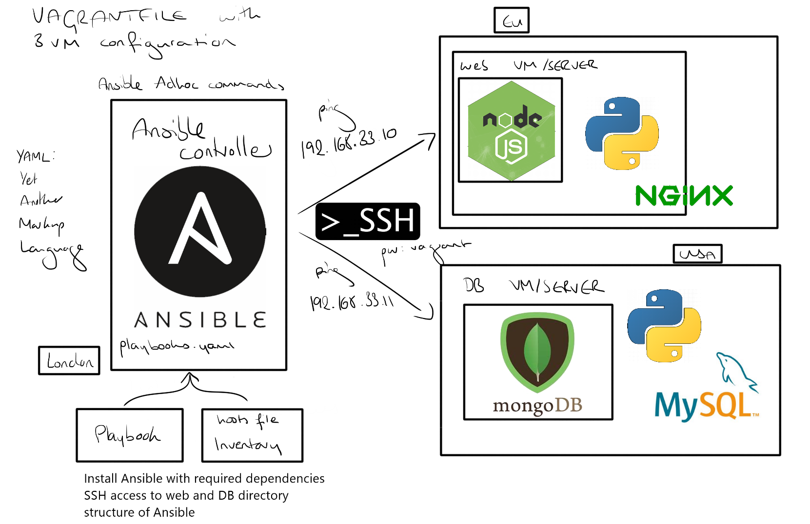

# Infrastructure as Code

- method to provision and manage IT infrastructure through the use of  machine-readable definition files (i.e. source code)
- on premises or cloud
- mutable or immutable

## Benefits
- speed
- simplicity
- configuration consistency
- risk minimisation
- increased efficiency
- cost savings

## Best Practices
- codify everything
- document as little as possible
- maintain version control
- continuously test, integrate, deploy
- make infrastructure code modular
- make infrastructure immutable when possible

## Two Parts
- configuration management
    - tools responsible for provisioning and maintaining the state of your systems
    - e.g. Chef, Puppet, Ansible
- orchestration
    - talk to the cloud to pull templates together into the architecture
    - e.g. CloudFormation (AWS), Ansible, Terraform
    
## Benefits of Ansible
- uses YAML, which is human-readable
- agentless - do not need to install Ansible on agent nodes, only the master
    - this makes the agent nodes lightweight
- uses SSH to connect to any other server
- growing of multi-cloud and hybrid cloud - 
- common platform
- integrates with other tools, e.g. Jenkins, Docker



- command to SSH into app and db from controller is `ssh vagrant@ip`

## Adhoc Commands
- adhoc vs playbook
  - playbooks contain series of commands to configure, deploy and orchestrate, and are useful for repeating tasks in the same way
  - adhoc commands are run directly in the command line, and are useful for rarely used commands
- need to add hosts to /etc/ansible/hosts
```
[web]
ip ansible_connection=ssh ansible_ssh_user=vagrant ansible_ssh_pass=vagrant
```
- can then use `ansible web -m ping`
- can also use `ping ip`
- `ansible web -a "command"` gets information of other machines from the controller, e.g. `uname`, `date`
- `ansible db -m shell -a "uptime"` to find uptime of the db server
- `ansible all -a "sudo apt-get update"` to update all packages
- `ansible all -a "sudo apt-get upgrade"` to upgrade

## Playbooks
- written in YAML with .yml/.yaml extension with set of instructions/tasks to do the configuration management on the hosts/agent nodes
- YAML files need to start with three dashes `---`
- indentation should be done with spaces, not tabs

## Setting up Ansible Vault

### Methods to secure AWS keys
- .gitignore
- ssh to access machines
- env variable
- SSH agent
- Ansible vault
  - the most secure option
  
### Setup
- create a `group_vars` directory inside `/etc/ansible`, and `all` inside that
- cd into the `all` directory
- `sudo ansible-playbook install_nginx.yml --ask-vault-pass`
- in the file, write:
```
aws_access_key: THISISMYACCESSKEY
aws_secret_key: THISISMYSECRETKEY
```
- press `esc :wq enter` to save the file
- the keys are now encrypted


## Ansible with EC2 task

- set up EC2 install called `controller`

- set up controller:
```
sudo apt-get update -y
sudo apt-get upgrade -y
sudo apt-get install software-properties-common
sudo apt-add-repository ppa:ansible/ansible
sudo apt-get update
sudo apt-get install ansible -y
ansible --version
sudo apt-get install tree

sudo apt install python3-pip -y
pip3 install boto boto3
pip3 install awscli

cd /etc/ansible

sudo mkdir group_vars
cd group_vars
sudo mkdir all
cd all

sudo ansible_vault create pass.yml
```

- in the pass file, write:
```
aws_access_key: THISISMYACCESSKEY
aws_secret_key: THISISMYSECRETKEY
```

- add in hosts file:
```
[local]
localhost ansible_python_interpreter=/usr/bin/python3

[web]
ip ansible_connection=ssh ansible_ssh_user=vagrant ansible_ssh_pass=vagrant

[db]
ip ansible_connection=ssh ansible_ssh_user=vagrant ansible_ssh_pass=vagrant
```

- use `sudo nano playbook_name.yml` to create playbooks in the `/etc/ansible` directory

- playbook to create web instance:
```
---
# create a new EC2 instance called web

- hosts: localhost
  connection: local
  gather_facts: no

  vars:
    key_name: eng84devops
    region: eu-west-1
    image: ami-0943382e114f188e8

  tasks:

    - name: Create security group
      ec2_group:
        name: eng84_isobel_ansible_web_sg
        description: "eng84_isobel_ansible_web_sg"
        region: "{{ region }}"
        aws_access_key: "{{aws_access_key}}"
        aws_secret_key: "{{aws_secret_key}}"
        rules:
# ssh from local machine
          - proto: tcp
            ports:
              - 22
            cidr_ip: local_ip
# ssh from controller
          - proto: tcp
            ports:
              - 22
            cidr_ip: controller_ip
          - proto: tcp
            ports:
              - 80
            cidr_ip: 0.0.0.0/0
          - proto: tcp
            ports:
              - 3000
            cidr_ip: 0.0.0.0/0
      register: result_sec_group

    - name: Create instance
      ec2:
        aws_access_key: "{{aws_access_key}}"
        aws_secret_key: "{{aws_secret_key}}"
        key_name: eng84devops
        image: "{{image}}"
        instance_type: t2.micro
        region: "{{region}}"
        wait: true
        count: 1
        instance_tags:
          Name: eng84_isobel_ansible_web
```

- playbook to create db instance:
```
---
# create a new EC2 instance called web

- hosts: localhost
  connection: local
  gather_facts: no

  vars:
    key_name: eng84devops
    region: eu-west-1
    image: ami-0943382e114f188e8

  tasks:

    - name: Create security group
      ec2_group:
        name: eng84_isobel_ansible_db_sg
        description: "eng84_isobel_ansible_db_sg"
        region: "{{ region }}"
        aws_access_key: "{{aws_access_key}}"
        aws_secret_key: "{{aws_secret_key}}"
        rules:
# ssh from local machine
          - proto: tcp
            ports:
              - 22
            cidr_ip: 195.213.42.152/32
# ssh from controller
          - proto: tcp
            ports:
              - 22
            cidr_ip: 172.31.29.133/32
          - proto: tcp
            ports:
              - 27017
            cidr_ip: 0.0.0.0/0
      register: result_sec_group

    - name: Create instance
      ec2:
        aws_access_key: "{{aws_access_key}}"
        aws_secret_key: "{{aws_secret_key}}"
        key_name: eng84devops
        image: "{{image}}"
        instance_type: t2.micro
        region: "{{region}}"
        wait: true
        count: 1
        instance_tags:
          Name: eng84_isobel_ansible_db
```

- run creation playbooks:
```
ansible-playbook playbook_name.yml --ask-vault-pass
```

- add web and db IPs to hosts file
```
[local]
localhost ansible_python_interpreter=/usr/bin/python3

[web]
ip ansible_connection=ssh ansible_ssh_user=ubuntu ansible_ssh_pass=ubuntu

[db]
ip ansible_connection=ssh ansible_ssh_user=ubuntu ansible_ssh_pass=ubuntu
```

- ssh into web and db to add fingerprint

- playbook to provision db:
```
---

- hosts: db
  gather_facts: yes
  become: true

  tasks:

  - name: Installing MongoDB in DB server
    apt: pkg=mongodb state=present
```

- playbook to provision web:
```
---

- hosts: web
  gather_facts: yes
  become: true

  tasks:
  - name: Installing nginx in web server
    apt: pkg=nginx state=present

  - name: Installing nodejs in web server
    apt: pkg=nodejs state=present

  - name: Installing npm in web server
    apt: pkg=npm state=present

#  - name: Cloning Github repo into web server
#    script: git clone -b main https://github.com/isobelfc/eng84_cicd_jenkins.git

#  - name: Setting database variable
#    script: echo echo "export DB_HOST="mongodb://192.168.33.11/27017/posts"" >> ~/.bashrc

#  - name: Setting up reverse proxy
 #   bash: |
  #      sudo echo "server {
   #       listen 80;
#
 #         server_name _;
#
 #         location / {
  #          proxy_pass http://localhost:3000;
   #         proxy_http_version 1.1;
    #        proxy_set_header Upgrade $http_upgrade;
     #       proxy_set_header Connection 'upgrade';
      #      proxy_set_header Host $host;
       #     proxy_cache_bypass $http_upgrade;
        #  }
      #  }" | sudo tee /etc/nginx/sites-available/default

#  - name: Running seed.js file in web server
#    bash: nodejs eng84_cicd_jenkins/app/seeds/seed.js

#  - name: Running app.js
#    bash: nodejs eng84_cicd_jenkins/app/app.js
```

- run provision playbooks:
```
ansible-playbook playbook_name.yml --ask-vault-pass
```